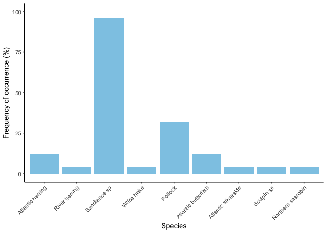
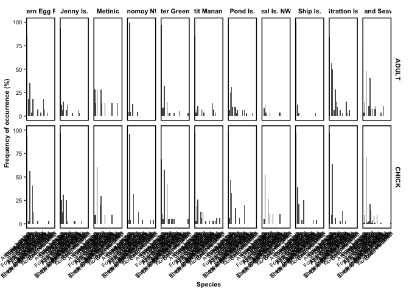
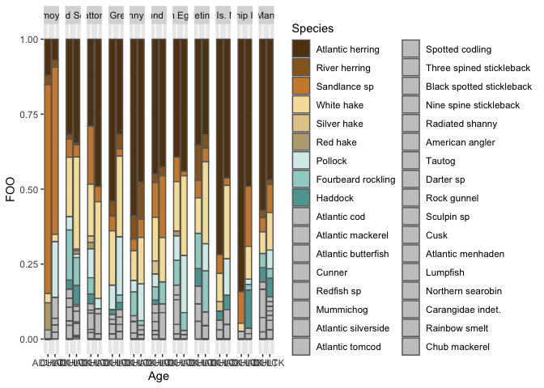

Plots for WSC3
================
Gemma Clucas
9/29/2021

### Read in the rarefied feature table

``` r
df <- read.csv("MiFish/WSC3_terns/Data-for-WSC3-only_plates7-14.csv", header = TRUE) 
```

### Create plotting order

I need to define the order of the fish along the x-axis, so that it is
consistent among graphs.

``` r
# Define x axis order
Species_ordered <-  c("Atlantic herring",
                      "River herring",
                      "Sandlance sp",
                      "White hake",
                      "Silver hake",
                      "Red hake",
                      "Pollock",
                      "Fourbeard rockling",
                      "Haddock",
                      "Atlantic cod",
                      "Atlantic mackerel",
                      "Atlantic butterfish",
                      "Cunner",
                      "Redfish sp",
                      "Mummichog",
                      "Atlantic silverside",
                      "Atlantic tomcod",
                      "Spotted codling",
                      "Three spined stickleback",
                      "Black spotted stickleback",
                      "Nine spine stickleback",
                      "Radiated shanny",
                      "American angler",
                      "Tautog",
                      "Darter sp",
                      "Rock gunnel",
                      "Sculpin sp",
                      "Cusk",
                      "Atlantic menhaden",
                      "Lumpfish",
                      "Northern searobin",
                      "Carangidae indet",
                      "Red lionfish",
                      "Rainbow smelt",
                      "Chub mackerel")

# # These colours are the ones Liz originally had, although I have messed with the order somewhat
# Species_with_colours <- c("Atlantic herring" = rgb(98, 64, 18, max = 255),
#                       "River herring" = rgb(150, 102, 34, max = 255),
#                       "Sandlance sp" = rgb(207, 138, 54, max = 255),
#                       "White hake" = rgb(247, 224, 167, max = 255),
#                       "Silver hake" = rgb(225, 204, 150, max = 255),
#                       "Red hake" = rgb(187, 169, 126, max = 255),
#                       "Pollock" = rgb(214,    237, 234, max = 255),
#                       "Fourbeard rockling" = rgb(159, 211, 204, max = 255),
#                       "Haddock" = rgb(92, 164, 160, max = 255),
#                       "Atlantic cod" = rgb(50,    118, 113, max = 255),
#                       "Atlantic mackerel" = rgb(30, 75, 63, max = 255),
#                       "Atlantic butterfish" = rgb(5, 60, 245, max = 255),
#                       "Cunner" = rgb(5, 57, 237, max = 255),
#                       "Redfish sp" = rgb(6, 56, 234, max = 255),
#                       "Mummichog" = rgb(4, 50, 211, max = 255),
#                       "Atlantic silverside" = rgb(3, 44, 190, max = 255),
#                       "Atlantic tomcod" = rgb(3, 46, 199, max = 255),
#                       "Spotted codling" = rgb(3, 39, 175, max = 255),
#                       "Three spined stickleback" = rgb(1, 34, 157, max = 255),
#                       "Black spotted stickleback" = rgb(2, 29, 141, max = 255),
#                       "Nine spine stickleback" = rgb(1, 26, 122, max = 255),
#                       "Radiated shanny" = rgb(2, 21, 100, max = 255),
#                       "American angler" = rgb(2,  19, 90, max = 255),
#                       "Tautog" = rgb(1,   15, 80, max = 255),
#                       "Darter sp" = rgb(0, 8, 60, max = 255),
#                       "Rock gunnel" = rgb(0, 0,0, max = 255),
#                       "Sculpin sp"= rgb(0, 0,0, max = 255),
#                       "Cusk"= rgb(0, 0,0, max = 255),
#                       "Atlantic menhaden"= rgb(0, 0,0, max = 255),
#                       "Lumpfish"= rgb(0, 0,0, max = 255),
#                       "Northern searobin"= rgb(0, 0,0, max = 255),
#                       "Carangidae indet." = rgb(0, 0,0, max = 255),
#                       "Rainbow smelt" = rgb(0, 0,0, max = 255),
#                       "Chub mackerel" = rgb(0, 0,0, max = 255))

# Here I am going to make everything after haddock grey.

grey <- rgb(200,    200, 200, max = 255)

Species_with_colours <- c("Atlantic herring" = rgb(98, 64, 18, max = 255),
                      "River herring" = rgb(150, 102, 34, max = 255),
                      "Sandlance sp" = rgb(207, 138, 54, max = 255),
                      "White hake" = rgb(247, 224, 167, max = 255),
                      "Silver hake" = rgb(225, 204, 150, max = 255),
                      "Red hake" = rgb(187, 169, 126, max = 255),
                      "Pollock" = rgb(214,  237, 234, max = 255),
                      "Fourbeard rockling" = rgb(159, 211, 204, max = 255),
                      "Haddock" = rgb(92,   164, 160, max = 255),
                      "Atlantic cod" = grey,
                      "Atlantic mackerel" = grey,
                      "Atlantic butterfish" = grey,
                      "Cunner" = grey,
                      "Redfish sp" = grey,
                      "Mummichog" = grey,
                      "Atlantic silverside" = grey,
                      "Atlantic tomcod" = grey,
                      "Spotted codling" = grey,
                      "Three spined stickleback" = grey,
                      "Black spotted stickleback" = grey,
                      "Nine spine stickleback" = grey,
                      "Radiated shanny" = grey,
                      "American angler" = grey,
                      "Tautog" = grey,
                      "Darter sp" = grey,
                      "Rock gunnel" = grey,
                      "Sculpin sp"= grey,
                      "Cusk"= grey,
                      "Atlantic menhaden"= grey,
                      "Lumpfish"= grey,
                      "Northern searobin"= grey,
                      "Carangidae indet." = grey,
                      "Rainbow smelt" = grey,
                      "Chub mackerel" = grey)
```

### Functions to calculate FOO from filtered feature table and plot FOO

I am going to filter the feature table for e.g. COTE adults from 2017 by
hand, but then I just want to be able to use functions to calculate FOO
and plot, to save on the amount of code I have to write.

``` r
calc_FOO <- function(x, n_samples) {
  x %>% 
  mutate_if(is.numeric, ~1 * (. > 0)) %>%     # change to detection/non-detection
  summarise_each(funs = sum) %>%              # count number of detections
  melt() %>%                                  # make into long dataframe
  rename(Occurrence = value,
         Species = variable) %>% 
  mutate(FOO = Occurrence/n_samples*100)
}


# get rid of periods in column names and order species
scrub_periods <- function(x) {
  x$Species <-  gsub("\\.", " ", x$Species)
  x$Species <- factor(x$Species, levels = Species_ordered)
}

cols <- c(rgb(142, 202, 230, max = 255), "#8ECAE6", "#219EBC", "#023047", "#FFB703", "#FB8500")

# function to plot, with the species in the order determined by Species_with_colours
plot_FOO <- function(x) {
  x %>% 
    ggplot() +
    geom_bar(aes(x = Species, y = FOO), stat = "identity", fill = cols[1]) +
    theme_classic() +
    theme(axis.text.x = element_text(angle = 45,  hjust=1)) +
    labs(y = "Frequency of occurrence (%)") +
    ylim(c(0, 100))
    #scale_fill_manual(values = cols[1])
}
```

### Monomoy chicks

Select the Monomoy chick data using `filter`, change to presence/absence
data using the `mutate_if` term, then `melt` to calculate the frequence
of occurrence.

``` r
# Filter the data and save to object
MON_chicks <- df %>% 
  filter(Colony == "Monomoy NWR" & Age == "CHICK") %>% 
  select(River.herring:Rainbow.smelt) 

# record number of records for calculating FOO
n_samples <- nrow(MON_chicks)
FOO <- calc_FOO(MON_chicks, n_samples)
```

    ## Warning: `summarise_each_()` was deprecated in dplyr 0.7.0.
    ## Please use `across()` instead.

``` r
FOO$Species <- scrub_periods(FOO)

FOO %>% 
  filter(FOO > 0) %>% 
  plot_FOO()
```

<!-- -->

### Plotting them all together on one, multipanel figure

I think I can use faceting to do this, but I need to combine all the FOO
data together into one dataframe. First, save the FOO data for each
group.

``` r
do_everything <- function(Colony_filter, Age_filter){
  x <- df %>% 
    filter(Colony == Colony_filter & Age == Age_filter) %>% 
    select(River.herring:Rainbow.smelt)
  n_samples <- nrow(x)
  y <- calc_FOO(x, n_samples)
  y$Species <- scrub_periods(y)
  return(y)
}

FOO_MON_CHICK <- do_everything("Monomoy NWR", "CHICK") %>% mutate(Colony = "Monomoy NWR", Age = "CHICK")
```

    ## No id variables; using all as measure variables

``` r
FOO_MON_ADULT <- do_everything("Monomoy NWR", "ADULT") %>% mutate(Colony = "Monomoy NWR", Age = "ADULT")
```

    ## No id variables; using all as measure variables

``` r
FOO_SEA_CHICK <- do_everything("White and Seavey Is.", "CHICK") %>% mutate(Colony = "White and Seavey Is.", Age = "CHICK")
```

    ## No id variables; using all as measure variables

``` r
FOO_SEA_ADULT <- do_everything("White and Seavey Is.", "ADULT") %>% mutate(Colony = "White and Seavey Is.", Age = "ADULT")
```

    ## No id variables; using all as measure variables

``` r
FOO_STI_CHICK <- do_everything("Stratton Is.", "CHICK") %>% mutate(Colony = "Stratton Is.", Age = "CHICK")
```

    ## No id variables; using all as measure variables

``` r
FOO_STI_ADULT <- do_everything("Stratton Is.", "ADULT") %>% mutate(Colony = "Stratton Is.", Age = "ADULT")
```

    ## No id variables; using all as measure variables

``` r
FOO_OGI_CHICK <- do_everything("Outer Green Is.", "CHICK") %>% mutate(Colony = "Outer Green Is.", Age = "CHICK")
```

    ## No id variables; using all as measure variables

``` r
FOO_OGI_ADULT <- do_everything("Outer Green Is.", "ADULT") %>% mutate(Colony = "Outer Green Is.", Age = "ADULT")
```

    ## No id variables; using all as measure variables

``` r
FOO_JEN_CHICK <- do_everything("Jenny Is.", "CHICK") %>% mutate(Colony = "Jenny Is.", Age = "CHICK")
```

    ## No id variables; using all as measure variables

``` r
FOO_JEN_ADULT <- do_everything("Jenny Is.", "ADULT") %>% mutate(Colony = "Jenny Is.", Age = "ADULT")
```

    ## No id variables; using all as measure variables

``` r
FOO_PON_CHICK <- do_everything("Pond Is.", "CHICK") %>% mutate(Colony = "Pond Is.", Age = "CHICK")
```

    ## No id variables; using all as measure variables

``` r
FOO_PON_ADULT <- do_everything("Pond Is.", "ADULT") %>% mutate(Colony = "Pond Is.", Age = "ADULT")
```

    ## No id variables; using all as measure variables

``` r
FOO_EGG_CHICK <- do_everything("Eastern Egg Rock", "CHICK") %>% mutate(Colony = "Eastern Egg Rock", Age = "CHICK")
```

    ## No id variables; using all as measure variables

``` r
FOO_EGG_ADULT <- do_everything("Eastern Egg Rock", "ADULT") %>% mutate(Colony = "Eastern Egg Rock", Age = "ADULT")
```

    ## No id variables; using all as measure variables

``` r
FOO_MET_CHICK <- do_everything("Metinic", "CHICK") %>% mutate(Colony = "Metinic", Age = "CHICK")
```

    ## No id variables; using all as measure variables

``` r
FOO_MET_ADULT <- do_everything("Metinic", "ADULT") %>% mutate(Colony = "Metinic", Age = "ADULT")
```

    ## No id variables; using all as measure variables

``` r
FOO_SINWR_CHICK <- do_everything("Seal Is. NWR", "CHICK") %>% mutate(Colony = "Seal Is. NWR", Age = "CHICK")
```

    ## No id variables; using all as measure variables

``` r
FOO_SINWR_ADULT <- do_everything("Seal Is. NWR", "ADULT") %>% mutate(Colony = "Seal Is. NWR", Age = "ADULT")
```

    ## No id variables; using all as measure variables

``` r
FOO_SHI_CHICK <- do_everything("Ship Is.", "CHICK") %>% mutate(Colony = "Ship Is.", Age = "CHICK")
```

    ## No id variables; using all as measure variables

``` r
FOO_SHI_ADULT <- do_everything("Ship Is.", "ADULT") %>% mutate(Colony = "Ship Is.", Age = "ADULT")
```

    ## No id variables; using all as measure variables

``` r
FOO_PMI_CHICK <- do_everything("Petit Manan Is.", "CHICK") %>% mutate(Colony = "Petit Manan Is.", Age = "CHICK")
```

    ## No id variables; using all as measure variables

``` r
FOO_PMI_ADULT <- do_everything("Petit Manan Is.", "ADULT") %>% mutate(Colony = "Petit Manan Is.", Age = "ADULT")
```

    ## No id variables; using all as measure variables

``` r
All_FOO <- FOO_MON_CHICK %>% 
  bind_rows(., FOO_MON_ADULT) %>% 
  bind_rows(., FOO_SEA_CHICK) %>% 
  bind_rows(., FOO_SEA_ADULT) %>% 
  bind_rows(., FOO_STI_CHICK) %>% 
  bind_rows(., FOO_STI_ADULT) %>% 
  bind_rows(., FOO_OGI_CHICK) %>% 
  bind_rows(., FOO_OGI_ADULT) %>% 
  bind_rows(., FOO_JEN_CHICK) %>% 
  bind_rows(., FOO_JEN_ADULT) %>% 
  bind_rows(., FOO_PON_CHICK) %>%
  bind_rows(., FOO_PON_ADULT) %>%
  bind_rows(., FOO_EGG_CHICK) %>%
  bind_rows(., FOO_EGG_ADULT ) %>%
  bind_rows(., FOO_MET_CHICK) %>%
  bind_rows(., FOO_MET_ADULT) %>%
  bind_rows(., FOO_SINWR_CHICK) %>%
  bind_rows(., FOO_SINWR_ADULT) %>%
  bind_rows(., FOO_SHI_CHICK) %>%
  bind_rows(., FOO_SHI_ADULT) %>%
  bind_rows(., FOO_PMI_CHICK) %>%
  bind_rows(., FOO_PMI_ADULT) 
  
All_FOO$Species <- scrub_periods(All_FOO)

All_FOO %>% 
  filter(FOO > 0) %>% 
  ggplot() +
  geom_bar(aes(x = Species, y = FOO), stat = "identity") +
  facet_grid(rows = vars(Age), cols = vars(Colony)) +
  theme_classic() +
  theme(axis.text.x = element_text(angle = 45,  hjust=1, colour = "black", margin = margin(t = 0)),
        axis.text.y = element_text(colour = "black"),
        axis.text=element_text(size=7),
        axis.title=element_text(size=8, face = "bold"),
        axis.ticks.x = element_blank(),
        panel.border=element_rect(colour="black",size=1, fill = NA),
        panel.spacing = unit(2, "mm"),
        strip.background = element_blank(),
        strip.text = element_text(colour = "black", size=8, face = "bold"),
        axis.line = element_blank()) +
  labs(y = "Frequency of occurrence (%)") +
  theme(legend.position = "none")
```

<!-- -->

Great… there is way too much to try to plot this on one figure. Can I
use pie charts instead?

``` r
# Use factors for ordering the islands
All_FOO$Colony_f = factor(All_FOO$Colony, levels = c("Monomoy NWR",
                                                     "White and Seavey Is.",
                                                     "Stratton Is.",
                                                     "Outer Green Is.",
                                                     "Jenny Is.",
                                                     "Pond Is.",
                                                     "Eastern Egg Rock",
                                                     "Metinic",
                                                     "Seal Is. NWR",
                                                     "Ship Is.",
                                                     "Petit Manan Is."))

p <- All_FOO %>% 
  ggplot() +
  geom_bar(aes(x= Age, y = FOO, fill = Species), stat = "identity", position = "fill", colour = "grey40") +
  facet_grid(~Colony_f) +
  scale_fill_manual(values = Species_with_colours) 
p
```

<!-- -->

``` r
ggsave(filename = "MiFish/WSC3_terns/stacked_barplots_all_colonies.jpg",
  plot = p,
  dpi = 600,
  device = "jpeg",
  width = 20,
  height = 6
)
```

``` r
All_FOO %>% group_by(Species) %>% 
  summarise(mean = mean(FOO))  %>% 
  arrange(-mean)
```

    ## # A tibble: 29 × 2
    ##    Species                   mean
    ##    <fct>                    <dbl>
    ##  1 Atlantic herring         83.0 
    ##  2 White hake               34.1 
    ##  3 Sandlance sp             24.0 
    ##  4 Pollock                  13.6 
    ##  5 Fourbeard rockling       10.5 
    ##  6 River herring             5.84
    ##  7 Haddock                   5.31
    ##  8 Three spined stickleback  4.11
    ##  9 Atlantic butterfish       4.09
    ## 10 Spotted codling           1.70
    ## # … with 19 more rows
